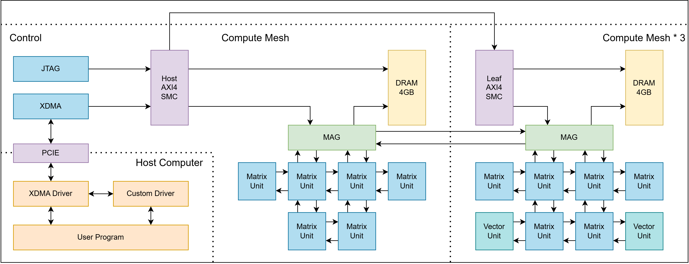

# KohakuTPU



**An open-source AI accelerator for FPGAs — the RTL, the compiler, and the
driver.** Matrix and vector units on a custom NoC mesh, four meshes on one
device, programmed from Python.

> Work in progress, built more for fun and for learning than for production. If
> you want to make it work for real, PRs are welcome.

```python
from kohakuaccel.lang import dims, loop, units
from kohakutpu.lang import kernel

from kohakutpu import lang as L

M, K, N = dims("M, K, N")
LOG2E = 1.4426950408889634


@kernel
def linear_silu(
    x=L.In(..., M, K), w=L.In(N, K), y=L.Out(..., M, N), *, gm=8, gn=8, nk=2
):
    """silu(x @ w.T), with the activation fused onto the accumulator."""
    with units(x.tiles(gm), w.tiles(gn)) as (i, j):
        acc = L.tile(gm, gn, nk)
        for k in loop(x.chunks32(nk)):
            acc += x[i, k] @ w[j, k]
        y[i, j] <<= acc * L.recip(L.exp2(acc * -LOG2E) + 1.0)
```

That last line is a matmul handing its result straight to a vector core over the
mesh — the activation never becomes a buffer in DRAM. Write the kernel, call it
like a function, and the compiler places it:

```python
from kohakutpu import api as ktpu

y = linear_silu(ktpu.tensor(x), ktpu.tensor(w))  # no launcher, no addresses
print(y.numpy())  # the only line that crosses the link
```

## Status

**Hardware — implemented.** Synthesised, implemented, and running on a real
FPGA: matrix clusters, vector cores, the NoC mesh and its routers, the memory
agent and quantiser, and the interlink that joins four meshes.

**Software — a working driver and compiler stack.** Kernels compile to cluster
*and* vector programs, flash attention runs, and tinygrad works as an optional
frontend into the same kernel library.

Every measured number, with the conditions it was taken under, is in
[`results.md`](docs/projects/kohakutpu/results.md).

## Future work

- **L2 cache** in the memory agent, and an L2 adapter at the NoC endpoint
- **Per-component clock control** and clock gating
- **Vector ISA** improvements
- **Memory mover** architecture and ISA — it moves 98 MB/s today, which bounds
  more than it should
- **Driver** improvements

## What makes it interesting

**A number format built for the DSP.** Elements are int7 with an **E5M3** scale
shared by a block of 32 — a microscaling format, but the scale is deliberately
*not* a power of two. An E8M0 scale wastes up to a full bit of significand
depending on where a block's peak falls in its binade; three mantissa bits put
that peak at 63 every time. Same 8-bit field, and measured relative error drops
from p50 0.54% to 0.38%.

**MACs that cost zero LUTs.** Four tensor CUs chain through the DSP48E2's
`PCOUT → PCIN` cascade, so the multiply *and* the whole K=32 reduction happen
inside the DSPs. The fabric holds control, not arithmetic.

**Two mesh ports per cluster, not five.** The DSP chain eats eight operand words
per cycle and a port delivers one, so more ports never close that gap. Holding a
large output tile resident does: a `Gm × Gn` block needs `4(Gm+Gn)/(Gm·Gn)` words
per cycle — 0.375 at 16×32. An arithmetic property, not a concession.

**A compiler that knows the machine has no threads.** Six levels, and only
adjacent ones may appear in one piece of code. A unit is *programmed*, not
commanded, so there is no `program_id` and no `__syncthreads` — the grid places
independent programs.

**A framework, with this chip as its first user.** `kohakuaccel` is the reusable
half — transport, mesh, dispatch, completion, the kernel language — and it
imports nothing from `kohakutpu`. A test fails the moment it does, and
`driver/examples/saxpy/` is a second, unrelated accelerator built on it alone.

## Quickstart

Python 3.13+, and numpy is the only hard dependency.

```bash
pip install -e .               # the whole tree: compiler, driver, kernels
pip install -e ".[tinygrad]"   # optional, adds the tinygrad frontend
pytest                         # 1152 tests, no hardware needed
```

Nothing reaches the card unless you ask for it — everything runs against unit
models by default, and `--device card` is a decision rather than a fallback.

```bash
python examples/kohakutpu/01_tensors.py       # learn by reading the code
python demos/kohakutpu/flash_attention.py     # learn by reading the output
python -m kohakutpu.viz                       # a kernel, at every level
```

For the RTL, simulation is Vivado `xsim` (the mesh needs `-L xpm`, so iverilog
will not do), and benches run against both a behavioural DSP and the real
`DSP48E2` so a failure is attributable to one or the other:

```bash
python scripts/py/check.py fast    # ~5 s, pure Python
python scripts/py/check.py full    # ~6 min, everything
```

## Documentation

**[`docs/`](docs/README.md)** is written to be read, and every page says what it
does, what it costs, and where it stops.

| | |
|---|---|
| [the framework](docs/integrate/README.md) | what you own, what is fixed, and how to put your own compute unit on it |
| [the machine](docs/projects/kohakutpu/README.md) | KohakuTPU top to bottom, in the order the decisions were forced |
| [writing kernels](docs/projects/kohakutpu/writing-kernels.md) | how much of the schedule to say, and what a tiling actually means |
| [the ISA](docs/projects/kohakutpu/isa.md) | the most accurate description of what it executes |
| [architecture](docs/arch/README.md) · [specs](docs/spec/README.md) · [workflow](docs/workflow/README.md) | the mesh and memory agent, the normative contracts, and the build/measure/bringup practice |

## Repository

```
   src/          Verilog: mesh, memory agent, AXI, compute units, ship assemblies
   compiler/     kernels, schedules and machine code  (kohakuaccel + kohakutpu)
   driver/       transports, dispatch, completion     (kohakuaccel + kohakutpu)
   examples/     read the code           demos/    read the output
   tests/        Verilog benches         scripts/  build, simulate, measure
```

`src/kohakutpu/` is Verilog; `compiler/kohakutpu/` and `driver/kohakutpu/` are
Python. The names collide, so when a comment names a path:
`src/kohakutpu/vector/vec_alu.v` is hardware and
`compiler/kohakutpu/hw/vector.py` is the model of it.

## License

Work in progress. During the WIP state, all source code and related resources
are released under a custom Kohaku-Code-License (or Kohaku-License if needed),
an open-access license with some restrictions on commercial usage. See the
License file.
